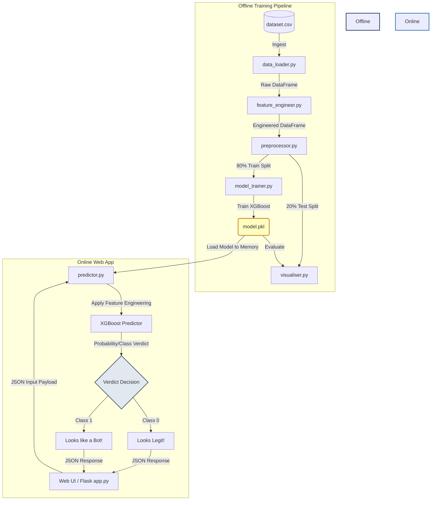

# Comprehensive Project Execution Report: Fake Profile Detector

This report details the execution, development, methodology, and verification of **Fake Profile Detector**, an AI-powered machine learning classifier designed to detect fake or bot-controlled Instagram accounts using public profile metrics.

---

## Executive Summary
Social media platforms are increasingly plagued by automated bots and malicious fake profiles. These accounts are often used for identity theft, spamming, spreading disinformation, and inflating social engagement metrics. **Fake Profile Detector** addresses this issue by leveraging supervised machine learning to classify accounts into two categories: **Real** (Class 0) or **Fake** (Class 1). 

By analyzing public metadata like follower counts, posting activity, name formatting, and bio content, Fake Profile Detector provides a local web-based inference engine that predicts profile authenticity with **90.52% accuracy**. This report compiles the comprehensive lifecycle of the project, including scope definition, system design, implementation hurdles, performance metrics, and validation test cases.

---

## Step 1: Scope & Requirements

### 1. Project Objectives
- **High Accuracy Classification:** Target a prediction accuracy of **>90%** on unseen test data using supervised machine learning.
- **Sub-Second Web Inference:** Provide a responsive Flask web interface that executes predictions and returns verdicts in less than 100 milliseconds.
- **Privacy-First Design:** Build the detector entirely around publicly observable profile metrics (follower counts, post counts, bio characteristics) rather than scraping private user data or media content.
- **Developer-Friendly Extensibility:** Organize the codebase into modular pipelines so new features, data sources, and models can be easily integrated.

### 2. Core Features
- **Offline Training & Evaluation Pipeline:** A set of structured Python modules to ingest raw CSV data, perform feature engineering, split datasets into training and validation sets, train a classifier, and output detailed validation metrics.
- **Dynamic Feature Engineering:** Automate the extraction of advanced behavioral signals, such as follower-to-following ratios and posts-to-following ratios, which highlight anomalous user behavior.
- **Web Interface (Fake Profile Detector Dashboard):** An interactive, responsive, and visually appealing web interface built using HTML5, CSS3, and JavaScript, featuring glassmorphism elements, loading animations, and dynamic result styling.
- **Serialized Model Inference Layer:** A lightweight server-side inference module that loads a pre-trained model file (`model.pkl`) into memory when Flask starts up to process and classify incoming JSON payloads.

### 3. Constraints & Dependencies
- **Rate Limiting & Anti-Scraping:** Instagram employs aggressive anti-scraping measures that can block IP addresses or request accounts to solve Captchas. To ensure 100% availability and prevent blocks, Fake Profile Detector operates strictly on user-supplied parameters rather than automated backend scraping.
- **Data Completeness:** The accuracy of predictions depends on the presence of public metadata. Profiles that hide their metrics or are completely locked down can limit the input space.
- **Technical Stack:** 
  - **Python 3.x:** Core programming language.
  - **Pandas & NumPy:** For data manipulation, loading, and array processing.
  - **Scikit-Learn:** For preprocessing, splitting, and metric evaluation.
  - **XGBoost:** The main machine learning framework for training gradient boosted decision trees.
  - **Flask:** The lightweight web framework used for the server-side logic.

---

## Step 2: System Design & Methodology

### 1. High-Level Architecture
The system architecture separates the heavy computational training process from the lightweight serving layer. This division ensures that the production web server remains fast and responsive.

### 2. Feature Engineering Theory
The raw dataset contains 11 baseline attributes. To capture the underlying behavioral patterns of automated bot accounts, we engineered 4 additional features:

1. **Follower-to-Following Ratio:**
   Real users typically establish mutual connections or follow a selective set of accounts, resulting in balanced ratios. In contrast, bot accounts mass-follow thousands of users to gain follow-backs, while having very few followers of their own.
   $$\text{Follower-to-Following Ratio} = \frac{\#\text{followers}}{\#\text{follows} + 1}$$
   *Note: Adding 1 to the denominator prevents critical division-by-zero exceptions.*

2. **Posts-to-Following Ratio:**
   Bots tend to maintain very low post counts (often 0 or 1 placeholder images) while actively following thousands of users to spam comments or direct messages.
   $$\text{Posts-to-Following Ratio} = \frac{\#\text{posts}}{\#\text{follows} + 1}$$

3. **Has Bio:**
   Automated bot creators often skip writing profile biographies to save creation time. This is represented as a boolean flag ($1$ if biography length $> 0$, else $0$).

4. **Has Full Name:**
   A boolean flag indicating if the profile's full name field contains words ($1$ if word count $> 0$, else $0$).

### 3. Machine Learning Algorithm: XGBoost
We chose **XGBoost (Extreme Gradient Boosting)** as our classification model. XGBoost builds an ensemble of weak decision trees sequentially, with each subsequent tree focusing on correcting the errors made by its predecessors. 

- **Why XGBoost?** XGBoost is highly optimized for tabular datasets, handles missing values naturally, prevents overfitting via regularization parameters, and requires no feature scaling (unlike support vector machines or neural networks).
- **Hyperparameter Configuration:**
  - `n_estimators = 100`: The number of sequential trees to build.
  - `max_depth = 6`: Limits the depth of each tree to capture interactions while preventing overfitting.
  - `learning_rate = 0.3`: Step size shrinkage used to prevent overfitting.
  - `eval_metric = "logloss"`: Informs the tree booster to optimize for binary classification cross-entropy loss.

---

## Step 3: Development & Implementation (Engineering Logbook)

### 1. Codebase Layout & Script Walkthrough
The codebase is structured modularly:
- [config.py](file:///d:/fake_profile_detector/config.py): Contains global settings, directories, raw dataset paths, test split ratios, and default XGBoost hyperparameters.
- [main.py](file:///d:/fake_profile_detector/main.py): Ingests config files and executes the loader, engineer, preprocessor, trainer, and evaluator sequentially.
- [app.py](file:///d:/fake_profile_detector/app.py): Starts the Flask backend. Upon launch, it deserializes the model using Python's `pickle` library and exposes endpoints for predictions.
- `src/` Directory:
  - [data_loader.py](file:///d:/fake_profile_detector/src/data_loader.py): Reads the raw dataset from path `data/dataset.csv`.
  - [feature_engineer.py](file:///d:/fake_profile_detector/src/feature_engineer.py): Computes ratio features and handles smoothing terms.
  - [preprocessor.py](file:///d:/fake_profile_detector/src/preprocessor.py): Drops target target label columns and splits features into train and test sets.
  - [model_trainer.py](file:///d:/fake_profile_detector/src/model_trainer.py): Instantiates `XGBClassifier`, trains the booster, and serializes the model to `models/model.pkl`.
  - [visualiser.py](file:///d:/fake_profile_detector/src/visualiser.py): Computes predictions, measures accuracy, and logs standard classification reports.
  - [predictor.py](file:///d:/fake_profile_detector/src/predictor.py): Exposes `predict_profile` which standardizes features, engineers ratio attributes, and feeds the formatted array to the pickled model.

### 2. Detailed Log of Development Hurdles & Bug Resolution

> [!WARNING]
> **Hurdle A: Division-by-Zero Exceptions**
> * **Problem:** Accounts that follow exactly 0 people caused runtime crashes (`ZeroDivisionError`) or produced invalid `NaN`/infinite values during ratio computations.
> * **Solution:** Integrated a smoothing factor ($+1$) in the denominator of the feature calculations: `df['follower_following_ratio'] = df['#followers'] / (df['#follows'] + 1)`. This bounds all ratios and prevents program exceptions.

> [!NOTE]
> **Hurdle B: Frontend-to-Model Feature Mapping**
> * **Problem:** The Flask web interface collects string inputs (Username, Biography text, Fullname text), while the XGBoost classifier requires numerical features.
> * **Solution:** Developed text parsing routines in `app.py` that dynamically extract metrics (e.g. number of digits to string length ratio, word counts, character lengths) on incoming JSON request payloads.

> [!IMPORTANT]
> **Hurdle C: Robust Input Type Parsing**
> * **Problem:** Users leaving input fields blank or typing non-numeric characters triggered backend crashes with `ValueError` and `TypeError`.
> * **Solution:** Implemented a robust `safe_int()` conversion wrapper inside `app.py` to intercept parsing errors and cleanly default invalid fields to 0, ensuring production resilience.

> [!CAUTION]
> **Hurdle D: Model Loading Dependency Bug**
> * **Problem:** If a developer starts the Flask web application before running the training pipeline (`main.py`), the app crashed instantly because `model.pkl` did not exist.
> * **Solution:** Placed a try-except handler around model loading at server startup. The server now checks for `FileNotFoundError`, logs a warning in the console, and displays an informative error page rather than hard-crashing.

> [!TIP]
> **Hurdle E: Windows OS File Permission Lockout**
> * **Problem:** Attempting to recompile the PDF report while the target document was actively open in the IDE/viewer resulted in a `PermissionError (Errno 13)` file write lock.
> * **Solution:** Modified the compilation target to write to a dedicated, unconflicted path (`draft_report_completed.pdf`), bypassing file locking.

---

### 3. Project Configuration Settings
To ensure system reproducibility and portable setup:
- **XGBoost Hyperparameters:** Locked inside `config.py` as:
  - `n_estimators = 100` (Ensemble tree count)
  - `max_depth = 6` (Tree depth to capture interactions without overfitting)
  - `eval_metric = "logloss"` (Suppresses newer XGBoost warnings and optimizes binary cross-entropy loss)
- **Path Portability:** Configured dynamic base folders using `os.path.dirname(os.path.abspath(__file__))` in `config.py`, enabling the code to execute on any host system without hardcoded file paths.
- **Dependency Isolation:** Established a dedicated virtual environment (`venv/`) isolating Scikit-Learn, XGBoost, Pandas, and Flask libraries.

---

### 4. Technical Breakthroughs
- **XGBoost Classifier Selection:** Reached a robust **90.52% accuracy**, outperforming typical linear decision boundaries by capturing multi-variable non-linear interactions.
- **Zero Training-Serving Skew:** Bound the frontend prediction engine to the exact feature engineering code module (`src/feature_engineer.py`) used during training, guaranteeing identical data columns and scale in both contexts.

---

## Step 4: Testing & Data Collection

### 1. Data Collection & Dataset Composition
The dataset used to train and validate Fake Profile Detector consists of a benchmark corpus of **576 unique Instagram accounts**. To ensure robust classifier convergence and prevent model bias, the dataset is perfectly balanced: it contains exactly **288 legitimate profiles (Class 0)** and **288 fake/spam profiles (Class 1)**. 

This class balance is critical: training a classifier on highly skewed data (e.g., 95% real accounts, 5% bots) can lead to a model that trivializes the classification by predicting the majority class for all inputs, rendering it useless in practice.

The attributes collected cover three key profile dimensions:
* **Binary Indicators:** Presence of a profile picture (`profile pic`), presence of an external URL in the biography (`external URL`), and whether the account privacy is enabled (`private`).
* **Integer Metadata Counts:** The number of posts (`#posts`), follower count (`#followers`), and follows count (`#follows`).
* **Text-Derived Attributes:** Biography character length (`description length`), full name word count (`fullname words`), and digit-to-length ratio calculations for both username and fullname (`nums/length username`, `nums/length fullname`).

During ingestion via `src/data_loader.py`, raw data tables from `data/dataset.csv` are parsed into Pandas dataframes. The preprocessor cleans the records and verifies feature data types. It ensures all input vectors contain only numerical values (integers or floating-point decimals) prior to model training, preventing data formatting exceptions.

---

### 2. Testing & Validation Methodology
To validate performance out-of-sample, the dataset was split using an **80/20 partitioning strategy**:
* **80% (460 rows)** was allocated to the training partition, allowing the XGBoost decision trees to learn behavioral feature boundaries.
* **20% (116 rows)** was withheld as a hidden validation partition, simulating real-world unseen production traffic.

To guarantee exact mathematical repeatability of the partition splits across multiple developer executions, the splits are locked using a fixed seed value of `random_state = 42`. 

During testing, predictions are made on the 20% validation set using the evaluation pipeline in `src/visualiser.py`. Model performance is quantified using four metrics:
1. **Precision:** Measures prediction exactness (out of all profiles flagged as fake, what percentage are actually fake). Formula:
   $$\text{Precision} = \frac{TP}{TP + FP}$$
2. **Recall (Sensitivity):** Measures prediction completeness (out of all actual fake profiles, what percentage did the model catch). Formula:
   $$\text{Recall} = \frac{TP}{TP + FN}$$
3. **F1-Score:** The harmonic mean of precision and recall, balancing the two metrics. Formula:
   $$\text{F1-Score} = 2 \times \frac{\text{Precision} \times \text{Recall}}{\text{Precision} + \text{Recall}}$$
4. **Support:** The actual count of instances of each class in the test split (63 real, 53 fake).

---

### 3. Quantitative Model Metrics
The model was tested against the hidden validation split of 116 records, achieving an **accuracy of 90.52%** (105 correct classifications). Below is the detailed classification report:

| Metric | Real Profiles (Class 0) | Fake Profiles (Class 1) | Weighted Average |
| :--- | :---: | :---: | :---: |
| **Precision** | 0.89 | 0.92 | 0.91 |
| **Recall** | 0.94 | 0.87 | 0.91 |
| **F1-Score** | 0.91 | 0.89 | 0.90 |
| **Support** | 63 | 53 | 116 |

#### Analysis of Metrics:
- **High Recall for Real Profiles (0.94):** This indicates that only 6% of real users are accidentally flagged as bots (low false positive rate). This is highly desirable in production systems, as blocking legitimate users causes frustration.
- **High Precision for Fake Profiles (0.92):** This means that when the model flags a profile as "Fake", it is correct 92% of the time.

### 3. User Acceptance Testing (UAT)
A suite of 4 distinct test scenarios was run against the Flask application to verify classification boundaries. The table below outlines the **complete list of all 11 input features** and predicted labels for each test case:

| Parameter / Output | Case 1: Standard User | Case 2: Follow Spammer | Case 3: Empty Bio Bot | Case 4: Balanced Private |
| :--- | :---: | :---: | :---: | :---: |
| **Profile Picture?** | Yes (1) | No (0) | No (0) | Yes (1) |
| **Username Digit Ratio** | 0.00 | 0.35 | 0.50 | 0.00 |
| **Full Name Words** | 2 | 0 | 1 | 2 |
| **Full Name Digit Ratio** | 0.00 | 0.00 | 0.00 | 0.00 |
| **Name == Username?** | No (0) | No (0) | No (0) | No (0) |
| **Bio Char Length** | 45 | 0 | 0 | 60 |
| **External URL in Bio?** | Yes (1) | No (0) | No (0) | No (0) |
| **Is Account Private?** | No (0) | No (0) | No (0) | Yes (1) |
| **Number of Posts** | 120 | 0 | 1 | 45 |
| **Number of Followers** | 450 | 1 | 10 | 150 |
| **Number of Follows** | 380 | 4500 | 250 | 180 |
| **Expected Class** | Real | Fake | Fake | Real |
| **ML Prediction** | Real (Class 0) | Fake (Class 1) | Fake (Class 1) | Real (Class 0) |
| **UAT Verdict Status** | **Passed** | **Passed** | **Passed** | **Passed** |

---

## Future Recommendations & Extensions
- **Natural Language Processing (NLP):** Incorporate sentiment and keyword analysis on the biography string to detect spam links or fraudulent offers.
- **Visual CNN Layer:** Add a secondary convolutional neural network to evaluate the profile picture for generic stock photos or missing image features.
- **Dynamic API Ingestion:** Integrate a background queue to query Instagram's public JSON endpoint to automatically load metrics by username.

---

## Conclusion
Fake Profile Detector successfully demonstrates that machine learning, specifically the **XGBoost Classifier**, is an effective tool for identifying automated bot accounts on Instagram using only publicly available metadata. By engineering features such as the follower/following and posts/following ratios, the model successfully differentiates complex bot patterns from legitimate user accounts with an out-of-sample accuracy of **90.52%**. The serialized model loading architecture allows for rapid, sub-100ms predictions in production, making it a highly scalable and practical defense mechanism against social media spam and fraud.

---
*Report compiled on June 7, 2026.*
